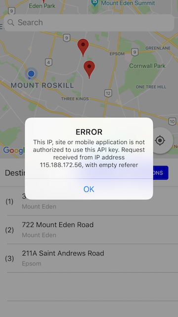
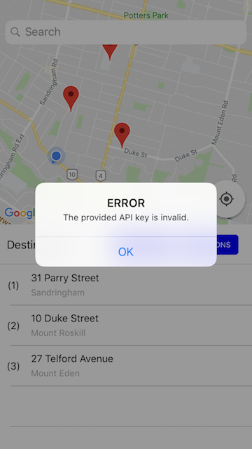
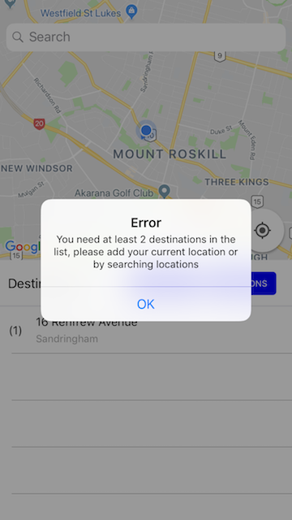
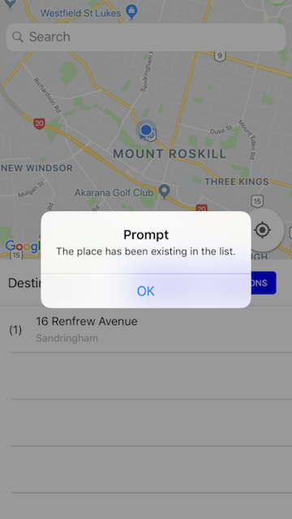

# TSP-Demo

## Note
> The purpose of this app is to take a list of destinations provided by the user and solve the classic Travelling Salesman Problem; that is, provide the shortest route which will go through all of the destinations.
> 
> Please have a revidew and provide feedback. 

## Services Dependency
> Google directions web service to support the route directions. A DirectionAPIKey is required (has been setting in the project) , you can also replace the Key with yours.
>
> https://developers.google.com/maps/documentation/directions/start

> GoogleMaps SDK to support the map. A MapsAPIKey is required (has been setting in the project) 
>
> https://developers.google.com/maps/documentation/ios-sdk/intro
>
> GooglePlaces SDK to support place searching. A PlacesAPIKey is required (has been setting in the project) 
>
> https://developers.google.com/places/ios-sdk/intro

## Development Environment
> Xcode Version 9.4
>
> Apple Swift version 4.1.2
>
> Apple iOS version  11.4

## TODO
>  Function - Notification
>
> Architecture improvement to make View Controller slim
>
> Unit Test
>
> Auto Layout

## Demo Videos 
### If the videos do not appear in your markdown reader, please find them under “demo-resources” folder
>  1. Typing in the search bar will bring up autofill suggestions
> 
>  <video src="demo-resources/add-place-by-search.mov" width="375" height="667" controls="controls"></video>
>  
> 
>  2. Current location. Make the map movable beneath the location marker to allow for precision if the location is slightly wrong
> 
>  <video src="demo-resources/add-place-by-using-current-location.mov" width="375" height="667" controls="controls"></video>
> 
> 
>  3. Activate the Travelling Salesman solve. (draw route on map for each section with different color )
> 
>  <video src="demo-resources/route-directions.mov" width="375" height="667" controls="controls"></video>
> 
> 

## Some Error Alerts

